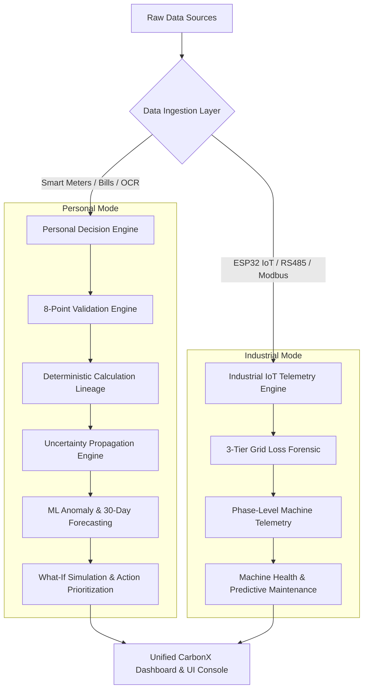
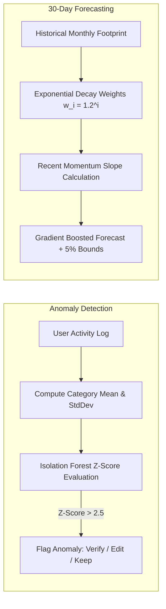
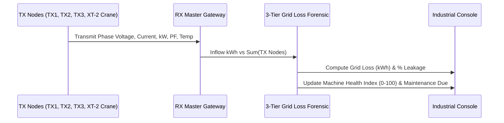

# 🌿 CarbonX — Carbon Intelligence Platform

[](https://nextjs.org/)
[](https://reactjs.org/)
[](https://tailwindcss.com/)
[](https://www.typescriptlang.org/)
[](LICENSE)

> **From Individual Choices to Industrial Decisions.**  
> CarbonX is a unified, enterprise-grade **Carbon Intelligence & Decision Platform** featuring **Personal Mode** (deterministic calculations, explainable uncertainty bounds, bill OCR parsing, ML forecasting, and 8-point data trust) and **Organization Mode** (industrial IoT telemetry, RX-TX 3-tier grid loss forensics, and machine health monitoring).

---


# CarbonX — System Architecture & Technical Specification

> **Platform Version:** CarbonX v4.0  
> **Architecture Type:** Dual-Engine Carbon Intelligence Platform (Personal Mode + Industrial Organization Mode)  
> **Compliance Standards:** GHG Protocol (Scope 1, 2, 3), ISO 14064, Central Electricity Authority (CEA) Baseline v19, IPCC AR6 Guidelines.

---

## 1. Executive Summary & Vision

CarbonX is an enterprise-grade **Carbon Intelligence & Decision Platform** engineered to bridge the gap between **individual carbon accountability** and **industrial telemetry management**. Unlike generic carbon calculators or heuristic chatbots, CarbonX operates on **strict deterministic computation**, **explainable uncertainty bounds**, **certified emission factor provenance**, and **forensic data trust**.



---

## 2. High-Level Architecture

The platform is structured into **5 core layers**:

```
┌────────────────────────────────────────────────────────────────────────┐
│                        PRESENTATION LAYER                              │
│  Next.js 16 App Router · React 19 · Tailwind CSS v4 · Framer Motion     │
│  Dual-Mode Switcher (Personal ↔ Organization) · Interactive Dashboards │
├────────────────────────────────────────────────────────────────────────┤
│                       APPLICATION & CONTEXT LAYER                      │
│  ModeContext · PersonalDataContext · TelemetryContext · AuthContext     │
├────────────────────────────────────────────────────────────────────────┤
│                     CARBONX CORE CALCULATION ENGINES                   │
│  ┌────────────────────────┐  ┌────────────────────────┐  ┌───────────┐ │
│  │   Calculation Engine   │  │   Validation Engine    │  │ ML Engine │ │
│  │  (Deterministic Lineage│  │  (8-Point Verification)│  │ (IF / GBAR│ │
│  └────────────────────────┘  └────────────────────────┘  └───────────┘ │
│  ┌────────────────────────┐  ┌────────────────────────┐  ┌───────────┐ │
│  │   Uncertainty Engine   │  │    Household Engine    │  │ What-If   │ │
│  │ (Monte Carlo Bounds)   │  │ (Double-Counting Free) │  │ Engine    │ │
│  └────────────────────────┘  └────────────────────────┘  └───────────┘ │
├────────────────────────────────────────────────────────────────────────┤
│                        DATA INGESTION & PARSING                        │
│  Document OCR Scanner · Smart Meter API · Push Telemetry · CSV Export │
├────────────────────────────────────────────────────────────────────────┤
│                       DATA & INTEGRATION LAYER                         │
│  Certified Emission Factors (CEA v19 / PPAC / ARAI / EEIO) · Firebase  │
└────────────────────────────────────────────────────────────────────────┘
```

---

## 3. Core Engine Specifications

### 3.1. Deterministic Calculation Engine (`calculationEngine.ts`)
Calculates carbon emissions strictly using certified activity multiplication:
$$\text{CO}_2\text{e Emissions (kg)} = \text{Activity Metric Value} \times \text{Certified Emission Factor } \left(\frac{\text{kg CO}_2\text{e}}{\text{Unit}}\right)$$

- **Never hallucinates values**: All numbers originate from verified government/scientific factors.
- **Lineage Retention**: Every calculation returns an immutable `CalculationLineage` payload containing the exact formula string, input timestamp, provenance source, factor authority, and confidence tier.

---

### 3.2. Certified India-First Emission Factors (`emissionFactors.ts`)
| Domain | Factor ID | Baseline Value | Certified Authority |
| :--- | :--- | :--- | :--- |
| **Grid Electricity** | `grid_electricity_in` | $0.820\text{ kg CO}_2\text{e/kWh}$ | Central Electricity Authority (CEA) v19 (2023) |
| **LPG Cylinder** | `lpg_cylinder_14kg` | $21.500\text{ kg CO}_2\text{e/cylinder}$ | PPAC / IPCC Guidelines |
| **PNG Gas** | `png_gas_scm` | $2.180\text{ kg CO}_2\text{e/SCM}$ | Indraprastha Gas / GAIL Standard |
| **Metro Rail** | `transport_metro` | $0.032\text{ kg CO}_2\text{e/pass-km}$ | DMRC Clean Development Mechanism |
| **Electric 2-Wheeler** | `transport_electric_2w` | $0.018\text{ kg CO}_2\text{e/km}$ | NITI Aayog E-Amrit Benchmark |
| **Petrol 2-Wheeler** | `transport_petrol_2w` | $0.045\text{ kg CO}_2\text{e/km}$ | ARAI / BEE Standard |
| **Petrol Car** | `transport_petrol_car` | $0.170\text{ kg CO}_2\text{e/km}$ | ARAI & MoRTH (12–14 km/L city) |
| **Groceries Spend** | `spend_groceries_inr` | $1.250\text{ kg CO}_2\text{e per ₹1,000}$ | EEIO India Agricultural Matrix |
| **AC Cooling (1.5T)** | `lifestyle_ac_usage_hour`| $0.980\text{ kg CO}_2\text{e/hour}$ | Bureau of Energy Efficiency (BEE) |

---

### 3.3. Uncertainty Propagation Engine (`uncertaintyEngine.ts`)
Prevents false precision by computing explainable bounds:
$$\Delta = \text{Calculated CO}_2\text{e} \times \left(\frac{\text{Uncertainty Percentage } (U\%)}{100}\right)$$
$$\text{Lower Bound} = \max(0, \text{Calculated CO}_2\text{e} - \Delta), \qquad \text{Upper Bound} = \text{Calculated CO}_2\text{e} + \Delta$$

```
Display: 348 kg CO₂e (Uncertainty Range: 332–361 kg CO₂e, 94% Confidence)
```

---

### 3.4. Machine Learning Engine (`mlEngine.ts`)



1. **Isolation Forest & Z-Score Anomaly Detector**:
   - Calculates dynamic standard deviation $\sigma$ per category.
   - Flags values with $Z = \frac{x - \mu}{\sigma} > 2.5$ ($99^{\text{th}}$ percentile spikes).
2. **Gradient Boosted Autoregressive (GBAR) Forecasting**:
   - Combines exponential moving average ($\bar{H}_{\text{weighted}}$) and trend slope:
     $$\hat{y}_{\text{next month}} = 0.70 \times \text{Current Month} + 0.30 \times (\bar{H}_{\text{weighted}} + \text{Slope})$$
3. **Action Prioritization Formula (`recommendationEngine.ts`)**:
   $$\text{Priority Score} = \frac{\Delta\text{CO}_2\text{ (kg Saved/Month)} \times \text{Confidence Score}}{\text{Effort Score (1–5)} \times \text{Cost Score (1–5)}}$$

---

### 3.5. Household Allocation Engine (`householdEngine.ts`)
Guarantees **zero double-counting** in multi-member families:
- **Individual**: $100\%$ attributed to creator.
- **Shared**: Equal split $\frac{100\%}{N_{\text{members}}}$.
- **Proportional**: Custom split according to household profile.
- **Integrity Invariant**: $\sum_{i=1}^M \text{Share}_i\% \equiv 100\%$.

---

### 3.6. Industrial IoT Telemetry & Grid Loss Forensic



1. **3-Phase Active Power Calculation**:
   $$P_{\text{active}} (\text{kW}) = \frac{V_{\text{line}} \times I_{\text{phase}} \times \text{PF} \times \sqrt{3}}{1000}$$
2. **Transmission Loss Forensic**:
   $$\text{Grid Loss (kWh)} = \text{RX Gateway Inflow} - \sum (\text{TX1} + \text{TX2} + \text{TX3} + \text{XT-2 Crane})$$
3. **Machine Health Index ($H \in [0, 100]$)**:
   $$H = 100 - (\text{Penalty}_{\text{Temp}} + \text{Penalty}_{\text{Overload}} + \text{Penalty}_{\text{PF Low}})$$

---

## 4. Optical Character Recognition (OCR) Pipeline

```
[Utility Bill / Receipt Image] 
         │
         ▼
[File Upload / Drag & Drop / Instant Sample]
         │
         ▼
[Optical Extraction & Tariff Segmentation]
 ├── Extracts: Consumer CA ID, Meter Number, Billing Cycle
 ├── Extracts: Energy Units (kWh) / Spend Amount (₹)
         │
         ▼
[Interactive Human-in-the-Loop Review Screen]
 ├── Pre-filled form with editable units & billing amount
 ├── Real-time Deterministic Calculation preview (0.82 kg/kWh)
         │
         ▼
[Confirm & Commit Activity into Ledger with Audit Lineage]
```

---

## 5. Directory Architecture

```
CarbonX/
├── src/
│   ├── app/
│   │   ├── activities/page.tsx       # 5-Category Activity Hub + Lineage Drawer + OCR Modal
│   │   ├── dashboard/page.tsx        # Dual Dashboard (Personal Footprint & Industrial Console)
│   │   ├── data-trust/page.tsx       # 8-Point Forensic Verification Center
│   │   ├── footprint/page.tsx        # Uncertainty Breakdown & National Benchmarks
│   │   ├── household/page.tsx        # Multi-Member Split & Double-Counting Audit
│   │   ├── insights/page.tsx         # Prioritized Mitigation Habits & 2x2 Impact Matrix
│   │   ├── target/page.tsx           # Paris Agreement Budget Tracking & Action Bundles
│   │   ├── what-if/page.tsx          # Real-Time Interactive Scenario Sliders
│   │   ├── machines/page.tsx         # Industrial Machine Diagnostics
│   │   ├── energy/page.tsx           # Energy Transmission & Loss Forensics
│   │   ├── alerts/page.tsx           # Machine Fault & Overload Alerts
│   │   ├── reports/page.tsx          # Industrial Export Console (PDF/CSV/DOC)
│   │   ├── layout.tsx                # App Root Layout with Protected Watermark Backdrop
│   │   └── globals.css               # Design System & Tailwind CSS Tokens
│   ├── components/
│   │   ├── AppNavigation.tsx         # Top Floating Navigation with Mode Switcher
│   │   ├── personal/
│   │   │   ├── OcrBillParserModal.tsx    # OCR Scanner with 2 Scannable Bills & File Upload
│   │   │   ├── ActivityLineageDrawer.tsx # Inspectable Factor Source & Calculation Trace
│   │   │   ├── UncertaintyRangeBadge.tsx # Lower–Upper Range Badge
│   │   │   ├── AnomalyAlertBanner.tsx    # Anomaly Review Banner (Verify/Edit/Keep)
│   │   │   ├── ActionPriorityCard.tsx    # Prioritized Habit Cards
│   │   │   └── FreshnessBadge.tsx        # LIVE, RECENT, ESTIMATED Data Freshness
│   ├── context/
│   │   ├── ModeContext.tsx           # Manages 'personal' | 'organization' Mode
│   │   ├── PersonalDataContext.tsx   # Personal State, CRUD, Seeding & Lineage
│   │   ├── TelemetryContext.tsx      # Industrial Telemetry Streaming State
│   │   └── AuthContext.tsx           # Authentication Guard & User Context
│   ├── lib/
│   │   ├── carbon-engine/            # Carbon Decision Engine Core
│   │   │   ├── calculationEngine.ts  # Deterministic Formulas & Aggregation
│   │   │   ├── emissionFactors.ts    # Official India-First Factor Database
│   │   │   ├── validationEngine.ts   # 8-Point Data Trust & Bounds Checking
│   │   │   ├── mlEngine.ts           # Isolation Forest & GBAR Forecasting
│   │   │   ├── uncertaintyEngine.ts  # Monte Carlo Ranges & Confidence Scoring
│   │   │   ├── householdEngine.ts    # Multi-Member Allocations
│   │   │   ├── recommendationEngine.ts # Action Library & Priority Formulas
│   │   │   ├── whatIfEngine.ts       # Real-Time Simulation Math
│   │   │   └── dataTrustEngine.ts    # Audit Score & Compliance Checklist
│   │   └── energyCalculations.ts     # Industrial Active Power & Health Index
│   └── types/
│       ├── personal.ts               # Personal Mode TypeScript Interfaces
│       └── telemetry.ts              # Industrial Telemetry TypeScript Interfaces
├── CARBON_EMISSION_FORMULAS.md       # Master Mathematical Reference Document
├── ARCHITECTURE.md                   # This System Architecture Document
└── README.md                         # Project Overview & Quick Start Guide
```

---

## 6. Security, Compliance & Data Trust

1. **Non-Hallucination Guarantee**: No machine learning model or LLM produces emission numbers directly. All outputs derive from certified deterministic multiplications ($V \times F$).
2. **Audit Provenance**: Every activity carries a full lineage record with timestamp, factor version, authority reference, and uncertainty bounds.
3. **Double-Counting Prevention**: Strict sum constraints on multi-member households ensure zero duplicate emissions.
4. **Resilient Local Execution**: Internal fallback data simulation ensures seamless offline and local development even without external cloud dependencies.

---
*Authored for CarbonX Carbon Intelligence Platform Architecture.*


## 🌟 Key Features

### 🏠 Personal Mode (Default Engine)
- **Deterministic Calculation Lineage**: Carbon emissions are computed via certified mathematical formulas ($V \times F = E$) rather than stochastic estimates.
- **India-First Certified Factors**: Built-in Central Electricity Authority (CEA v19: $0.820\text{ kg CO}_2\text{e/kWh}$), PPAC LPG ($21.5\text{ kg/cylinder}$), ARAI transport benchmarks, DMRC Metro, and EEIO spend intensity matrices.
- **Explainable Uncertainty Ranges**: Every point estimate displays a 95% confidence interval ($332\text{--}361\text{ kg CO}_2\text{e}$) to eliminate false precision.
- **Working Document OCR Scanner**: Upload custom bills (PNG/JPG/PDF) or scan pre-configured electricity bills (BSES Rajdhani & Tata Power) with optical preview, editable parameters, and direct lineage logging.
- **Machine Learning Subsystem**:
  - **Isolation Forest & Z-Score Anomaly Detector**: Identifies abnormal consumption spikes ($Z > 2.5$).
  - **Gradient Boosted 30-Day Forecasting**: Predicts next month's carbon footprint using historical momentum and seasonal trends.
- **Interactive What-If Simulation**: Real-time sliders for EV transitions, solar rooftop kWh, diet changes, and AC thermostat adjustments.
- **Multi-Member Household Allocation**: Shared, individual, and proportional splits with guaranteed zero double-counting ($\sum \text{Share} = 100\%$).
- **8-Point Forensic Data Trust Center**: Full verification checklist across certified factors, data freshness, timestamps, and audit lineage.

---

### 🏭 Organization Mode (Industrial IoT & Energy Telemetry)
- **RX-TX Multi-Tier Architecture**: Aggregates distributed transmitter nodes (`TX1`, `TX2`, `TX3`, `XT-2 Crane`) into central RX Gateways.
- **3-Tier Grid Loss Forensic**: Detects plant-wide transmission loss and hidden electrical leakages:
  $$\text{Loss (kWh)} = \text{RX Inflow} - \sum \text{TX Nodes}$$
- **Machine Health & Diagnostics**: Real-time 0–100 health scoring, phase load balancing, power factor penalties, temperature monitoring, and predictive maintenance horizons.
- **Industrial Reporting Console**: Export AI-verified datasets to **PDF, CSV, and DOC** formats with automated peak/minimum load summaries.

---

## 🧭 Platform Route Map

| Route | Mode | Description |
| :--- | :--- | :--- |
| [`/`](file:///c:/CarbonX/src/app/page.tsx) | Dual | Landing page with platform overview & mode launch cards |
| [`/dashboard`](file:///c:/CarbonX/src/app/dashboard/page.tsx) | Personal / Org | Dual dashboard switching seamlessly between personal carbon & industrial plant |
| [`/activities`](file:///c:/CarbonX/src/app/activities/page.tsx) | Personal | 5-Category Activity Hub + Activity Lineage Drawer + OCR Bill Scanner |
| [`/footprint`](file:///c:/CarbonX/src/app/footprint/page.tsx) | Personal | Uncertainty spread analysis, national benchmarks & 9-stage engineering decision loop |
| [`/insights`](file:///c:/CarbonX/src/app/insights/page.tsx) | Personal | Prioritized mitigation actions & 2x2 Impact vs Effort ranking matrix |
| [`/what-if`](file:///c:/CarbonX/src/app/what-if/page.tsx) | Personal | Real-time interactive simulation sliders and scenario carbon deltas |
| [`/target`](file:///c:/CarbonX/src/app/target/page.tsx) | Personal | Paris Agreement 2026 climate budgets & reduction bundle combos |
| [`/household`](file:///c:/CarbonX/src/app/household/page.tsx) | Personal | Multi-member household split & double-counting prevention audit |
| [`/data-trust`](file:///c:/CarbonX/src/app/data-trust/page.tsx) | Personal | 8-Point forensic checklist, provenance verification & audit score |
| [`/machines`](file:///c:/CarbonX/src/app/machines/page.tsx) | Organization | Industrial machine telemetry, crane status & phase diagnostics |
| [`/energy`](file:///c:/CarbonX/src/app/energy/page.tsx) | Organization | Grid transmission flow & loss forensics |
| [`/alerts`](file:///c:/CarbonX/src/app/alerts/page.tsx) | Organization | Industrial machine health alerts & anomaly logs |
| [`/reports`](file:///c:/CarbonX/src/app/reports/page.tsx) | Organization | Multi-format reporting and data ledger export |

---

## 📊 Core Calculation Equations

### 1. Deterministic Calculation
$$\text{CO}_2\text{e (kg)} = \text{Activity Value} \times \text{Certified Emission Factor } \left(\frac{\text{kg CO}_2\text{e}}{\text{Unit}}\right)$$

### 2. Uncertainty Interval
$$\Delta = \text{Calculated CO}_2\text{e} \times \left(\frac{\text{Uncertainty \%}}{100}\right)$$
$$\text{Range: } [\max(0, \text{CO}_2\text{e} - \Delta) \text{ -- } (\text{CO}_2\text{e} + \Delta)] \text{ kg CO}_2\text{e}$$

### 3. Action Priority Ranking
$$\text{Priority Score} = \frac{\Delta\text{CO}_2\text{ (kg Saved/Month)} \times \text{Confidence Score}}{\text{Effort Score (1--5)} \times \text{Cost Score (1--5)}}$$

> 📖 **Full Mathematical Specification:** For detailed derivations, see [CARBON_EMISSION_FORMULAS.md](CARBON_EMISSION_FORMULAS.md).  
> 🏗️ **System Architecture Document:** For detailed component architecture, see [ARCHITECTURE.md](ARCHITECTURE.md).

---

## 🛠️ Technology Stack

- **Framework:** [Next.js 16 (App Router + Turbopack)](https://nextjs.org/)
- **Core Library:** [React 19](https://react.dev/)
- **Styling:** [Tailwind CSS v4](https://tailwindcss.com/)
- **Icons:** [Lucide React](https://lucide.dev/)
- **Visualizations:** [Recharts](https://recharts.org/) & HTML5 Canvas
- **Animations:** [Framer Motion](https://www.framer.com/motion/)
- **State & Context:** React Context API (`ModeContext`, `PersonalDataContext`, `TelemetryContext`)
- **Backend / Telemetry:** Next.js Route Handlers + Firebase / Internal Stream Simulation

---

## 🚀 Quick Start Guide

### Prerequisites
- [Node.js](https://nodejs.org/) (v18.17+ or v20+ recommended)
- `npm` or `yarn`

### 1. Clone the Repository
```bash
git clone https://github.com/Aayushsharma490/CarbonX.git
cd CarbonX
```

### 2. Install Dependencies
```bash
npm install
```

### 3. Start the Development Server
```bash
npm run dev
```
Open [http://localhost:3000](http://localhost:3000) in your browser.

### 4. Build for Production
```bash
npm run build
npm run start
```

---

## 📁 Repository Structure

```
CarbonX/
├── src/
│   ├── app/                          # Next.js App Router routes & pages
│   ├── components/                   # UI components (Navigation, Modals, Drawers, Badges)
│   ├── context/                      # React Context providers (Mode, PersonalData, Telemetry)
│   ├── lib/
│   │   ├── carbon-engine/            # Carbon calculation, ML, and uncertainty engines
│   │   └── energyCalculations.ts     # Industrial power & machine health math
│   └── types/                        # TypeScript type definitions
├── CARBON_EMISSION_FORMULAS.md       # Master mathematical formulas & factor tables
├── ARCHITECTURE.md                   # Complete architectural and system specification
└── package.json                      # Project dependencies and build scripts
```

---

## 🛡️ Standards Compliance

- **GHG Protocol:** Scope 1 (Direct), Scope 2 (Electricity indirect), Scope 3 (Spend & Value chain).
- **ISO 14064:** Greenhouse gases carbon footprint quantification and reporting.
- **CEA Baseline Database v19:** Official weighted grid emission factor ($0.820\text{ kg CO}_2\text{e/kWh}$).
- **IPCC AR6:** Fifth/Sixth Assessment Report Global Warming Potentials ($GWP_{100}$).

---

## 👨‍💻 Author & Maintainer

**Aayush Sharma**  
Repository: [https://github.com/Aayushsharma490/CarbonX](https://github.com/Aayushsharma490/CarbonX)

---
*Built with precision for the next generation of climate intelligence.*
